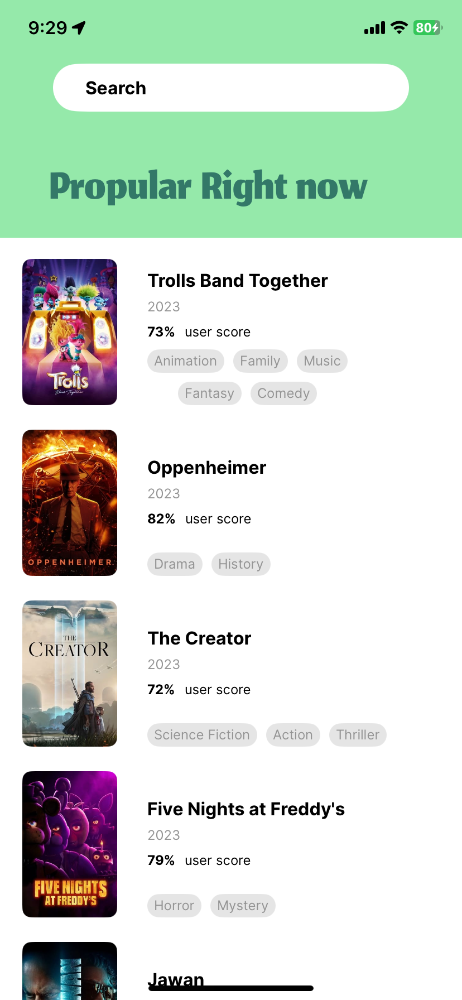
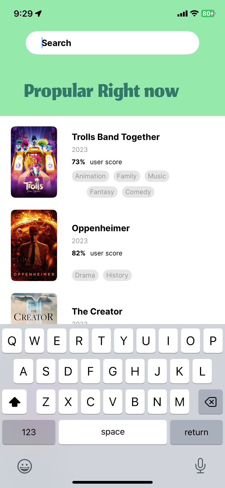
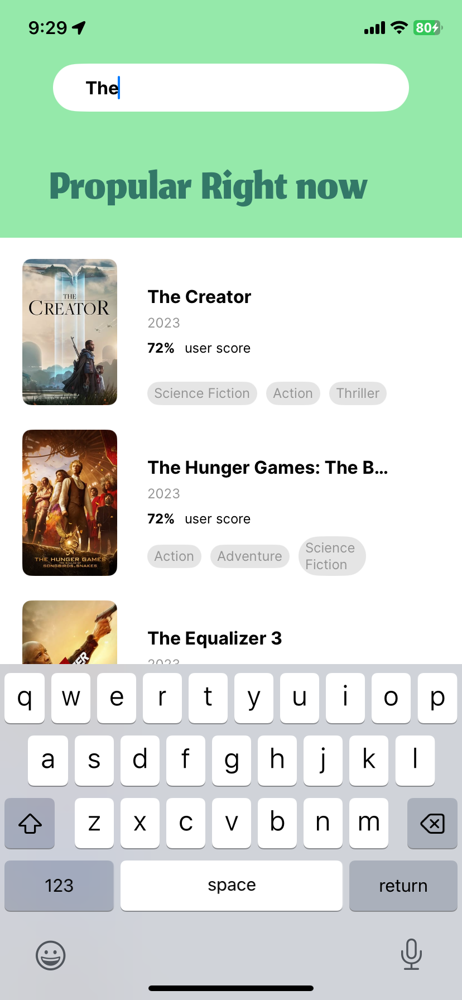
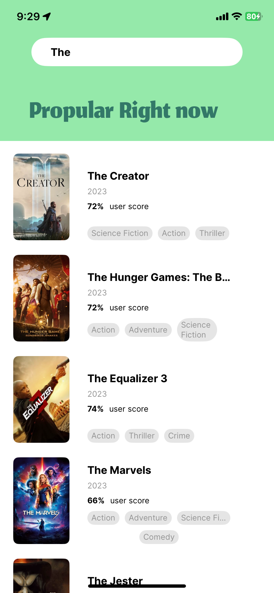

# TheMovieDB-DevChallenge

A movie information iOS application written in Programmatic Swift, powered by [The Movie Database API](https://developer.themoviedb.org/docs) and made in a single week. This app was created as part of a Development Challenge and features a searchable list of the top 20 most popular rated movies.

## Eample images

